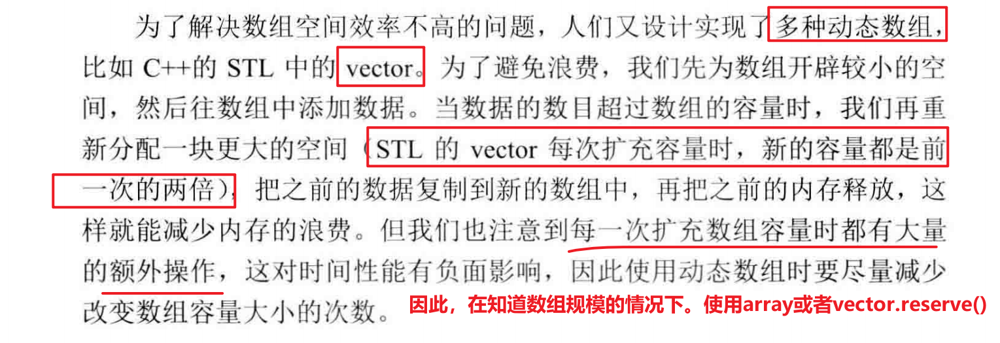
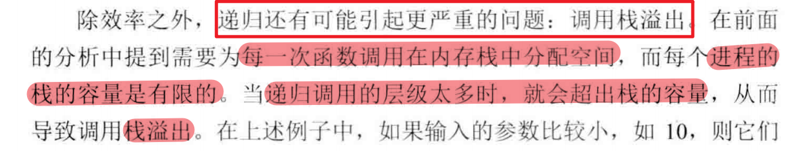

# ch01：面试的流程

**面试前的准备**

- 自身知识储备
  - 算法和数据结构
  - 对公司的了解
- 合适的反问问题

## 行为面试环节

### **自我介绍：**

- 用 30 秒到1分钟的时间介绍 自己 的 主要学习、工作经历

- 做了哪些项目

  - 我在什么什么时间，在什么部门，参加了什么项目实习

  - 这个项目做什么的，我在里面扮演了什么角色，用了什么框架技术，最后有没有上线（实现了什么功能）**（STAR模型）**

    

### **问答环节：**

- 你在该项目中碰到 的 最大 问 题是什么 ，你是怎么解决的 ？
- 从这个项目中 你学到了什么？
- 什么时他候会和其他团队成员（包括开发 人员、测试人员、设计人员、项目经理等）有什么样的冲突 ，你们 是怎么解决冲突的？

### 技术面试环节


#### 知识储备：

1. **数据结构**
   - 链表
   - 树
   - 栈
   - 队列
   - 哈希表
2. **算法**
   - 查找：二分查找
   - 排序：归并排序、快速排序

# ch02：面试需要的基本知识

## C++的基础知识

- 面向对象的特性
- 构造函数
- 析构函数
- 动态绑定
- 设计模式
- 常用的数据结构和算法
- C++关键字  

## 推荐的参考书籍

- [x] 《effective C++》
- [ ] 《C++ Primer》
- [ ] 《深度探索C++对象模型》
- [ ] 《The C++ Programming Language》

## 数据结构

### 数组

1. 数组的容量大小
2. 内存分配`memset(arr, val, sizeof(var));`

**优点：**

由于数组中的内存时连续的，于是可以根据下标在O(1)的时间读/写任何元素。效率很高

**缺点：**

即使我们只在数组中存储一 个数字 ，也 需要为所有 的数据预先分配内存 。 因此数组的空间效率不是很好 ， 经常会有空 闲的 区域没有得到充分利用 。  



## 算法

### 查找

- 顺序查找

-  **二 分查找** 

- 哈希表查找：O(1)

  > 哈希表的底层实现？
  >
  > 哈希冲突的解决办法

- 二叉排序树**：二叉排序树的中序遍历的有序性**

#### **二分查找**

二分查找的应用场景：问题可以根据某种条件分为两个区间。

#### 二分查找相关题型：

1. 旋转数组的最小数字

   

   

### 排序：

- [ ] 插入排序
- [ ] 冒泡排序
- [ ] 选择排序
- [ ] 快速排序
- [ ] 归并排序
- [ ] 堆排序
- [ ] 希尔排序
- [ ] 桶排序

#### 快速排序

```c++

```

#### 排序算法相关题型


#### 排序算法的分析


### 其他算法

#### 回溯法

回溯法可以用递归的代码实现，当不让用递归的时候，可以用栈来模拟递归的过程

#### 动态规划

#### 贪心算法的证明

#### 位运算

1. 与
2. 或
3. 异或
4. 左移
5. 右移

# 剑指offer的面试题

## 实现一个operator=

赋值运算符函数实现**需要关注的问题**

- 返回值的类型：声明为该类型的引用 ， 并在函数结束前返回实例自身的引用 ( *this ) 。 **只 有返回 一个引用 ， 才可以允许连续赋值。**  
- 传入参数为**常量引用**，因为如果传入的参数不是引用而是实例，那么从形参到实参会调用一次复制构造函数。因此需要传引用。**并且我们不需要更改传入的实例状态，因此应该添加const**
- 是否释放实例自身已有的内存。如果我们忘记在分配新内存之前释放自身已有的空间，则程序将出现内存泄漏 
- 判断传入的参数和当前的实例*this是不是同 一个实例 。如果是，就会出现内存重复释放的问题 

```c++
// 实例代码1：
CMyString& CMyString::opcrator=(const CMyString &str)
{
   if(this != &str)
   {
    CMyString strTemp(str);
       
    char* pTemp = strTemp.m_pData;
    strTemp.m_pData = m_pData;
    m_pData = pTemp;
   }  // 利用局部实例strTemp的自动析构，释放其内部数据
    rerurn *this;
}

// 实例代码2：
CMyString& CMyString::opcrator=(const CMyString &str)
{
   if(this != &str)
   {       
    char* pTemp = m_pData;
    try{
		m_pData = new char[strlen(pTemp) + 1];
        strcpy(m_pData, str.m_pData);
        delete str.m_pData;
    }
    catch(bad_alloc){
        
    }
    strTemp.m_pData = m_pData;
    m_pData = pTemp;
   }  // 利用局部实例strTemp的自动析构，释放其内部数据
    rerurn *this;
}
```

## 实现Singleton模式

**设计一个类，我们只能生成该类的一个实例。不管是哪个线程调用该函数，都只能生成一个共享的类对象**

> 设计模式的内容。在面向对象程序设计中起着举足轻重的作用。
>
> muduo库就有单例的实现封装

```c++
// Use of this source code is governed by a BSD-style license
// that can be found in the License file.
//
// Author: Shuo Chen (chenshuo at chenshuo dot com)

#ifndef MUDUO_BASE_SINGLETON_H
#define MUDUO_BASE_SINGLETON_H

#include <boost/noncopyable.hpp>
#include <pthread.h>
#include <stdlib.h> // atexit

namespace muduo
{

template<typename T>
class Singleton : boost::noncopyable
{
 public:
  static T& instance() // 静态成员函数
  {
    pthread_once(&ponce_, &Singleton::init); // 通过pthread_once创建单例实例
    return *value_;
  }

 private:
  Singleton(); 
  ~Singleton();

  static void init()
  {
    value_ = new T();
    ::atexit(destroy); // 注册销毁函数
  }

  static void destroy()
  {
    typedef char T_must_be_complete_type[sizeof(T) == 0 ? -1 : 1];
    delete value_; // 对象销毁
  }

 private:
  static pthread_once_t ponce_;
  static T*             value_;
};

template<typename T>
pthread_once_t Singleton<T>::ponce_ = PTHREAD_ONCE_INIT;

template<typename T>
T* Singleton<T>::value_ = NULL;

}
#endif

// 使用示例
#include <muduo/base/Singleton.h>
#include <muduo/base/CurrentThread.h>
#include <muduo/base/Thread.h>

#include <boost/noncopyable.hpp>
#include <stdio.h>

class Test : boost::noncopyable
{
 public:
  Test()
  {
    printf("tid=%d, constructing %p\n", muduo::CurrentThread::tid(), this);
  }

  ~Test()
  {
    printf("tid=%d, destructing %p %s\n", muduo::CurrentThread::tid(), this, name_.c_str());
  }

  const muduo::string& name() const { return name_; }
  void setName(const muduo::string& n) { name_ = n; }

 private:
  muduo::string name_;
};

void threadFunc()
{
  printf("tid=%d, %p name=%s\n",
         muduo::CurrentThread::tid(),
         &muduo::Singleton<Test>::instance(),
         muduo::Singleton<Test>::instance().name().c_str());
  muduo::Singleton<Test>::instance().setName("only one, changed");
}

int main()
{
  muduo::Singleton<Test>::instance().setName("only one");
  muduo::Thread t1(threadFunc);
  t1.start();
  t1.join();
  printf("tid=%d, %p name=%s\n",
         muduo::CurrentThread::tid(),
         &muduo::Singleton<Test>::instance(),
         muduo::Singleton<Test>::instance().name().c_str());
}

```


### 单例模式的理解：


# 剑指offer的代码题

## 数组

### 数组中重复的数字

**问题描述：**

在一个长度为 n 的数组里的所有数字都在 0 ~n-1 的范围内。数组中某些数字是重复的，但不知道有几个数字重复了，也不知道每个数字重复了几次。请找出数组中任意一个重复的数字。例如，如果输入长度为 7 的数组 {2, 3, 1, 0, 2, 5, 3}, 那么对应的输出是重复的数字 2 或者 3。  

**思路1：**

> 排序+扫描，排序一个长度为n的数组需要`O(nlogn)`的时间，扫描的话O(N)
>
> **时间复杂度：O(nlogn)**
>
> **空间复杂度：O(1)**

**思路2：**

> 利用哈希表，从头到尾扫描整个数组。每扫描到一个数字的时候，判断该数字是否包含。如果不包含，就把它加入哈希表。否则返回。
>
> **时间复杂度：O(n)**
>
> **空间复杂度O(n)**

**空间复杂度优化方案：**


**考虑可能出现的测试用例：**

1. 长度为n的数组里包含一个或多个重复的数字
2. 数组中不包含重复的数字
3. 无效的输入测试用例（数组为空、`数组元素不在范围[0, n-1]之内`)

**代码实现：**

```c++
// 书上的代码逻辑实现
int findRepeatNumber(vector<int>& nums) {
    int n = nums.size();

    for(int i = 0; i < n; i++)
    {
        if(nums[i] < 0 || nums[i] >= n) return -1; //元素数据不合格的情况
        if(nums[i] == i) continue;
        else
        {
            if(nums[nums[i]] == nums[i]) return nums[i];
            else swap(nums[i], nums[nums[i]]);
        }
    }

    return -1;
}
```

### 不修改数组找出重复的数字

在一个长度为 n+1 的数组里的所有数字都在 1,.....,n 的范围内，所以数组中至少有一个数字是重复的。请找出数组中**任意一个重复的数字，但不能修改输入的数组** 。 例如，如果输入长度为 8 的数组 {2, 3, 5, 4, 3, 2, 6, 7}, 那
么对应的输出是重复的数字 2 或者 3 。  

**需要考虑的测试样例情况：**

- [x] 数组元素不在[1, n]范围内
- [x] 数组长度为0的时候
- [ ] 包含一个或多个重复的数字
- [ ] 不包含重复的数字（不可能，鸽笼原理）

**思路1：**

> 哈希表查重。
>
> 时间复杂度:O(n)
>
> 空间复杂度:O(n)

**思路2：**

> 因为[1, n]的元素总共有n个，而数组长度为n+1，那么我们统计[1, m]和(m, n]的频次，进行二分。

### [二维数组中的查找](https://leetcode-cn.com/problems/er-wei-shu-zu-zhong-de-cha-zhao-lcof/)

在一个二维数组中，每一行都按照从左到右递增的顺序排序，每一列都按照从上到下递增的顺序排序。请完成一个函数，输入这样的一个二维数组和一个整数，判断数组中是否含有该整数 。  

**思路1:**

> 暴力搜索法：遍历这个二维数组
>
> 时间复杂度:$o(n^2)$
>
> 空间复杂度:O(1)

**思路2：**

> 利用这个二维数组的特性。当前位置元素一定小于该行右侧元素，一定大于该列上部分元素。因此，从左下角开始搜索。

**代码示例：**

```c++
bool findNumberIn2DArray(vector<vector<int>>& matrix, int target) {
    int m = matrix.size();
    if(m == 0) return false;
    int n = matrix[0].size();
    int i = m-1;
    int j = 0;

    while( i >= 0 && j < n)
    {
        if(target == matrix[i][j]) return true;
        else if(target < matrix[i][j]) i--;
        else j++;
    }

    return false;
}
```

### [合并两个有序的数组](https://leetcode-cn.com/problems/merge-sorted-array/)


## 字符串

**C/C++中每个字符串都以字符'\0'作为结尾，因此容易造成字符串的越界**

```c++
// 因此，在进行char*的拷贝工作的时候。需要这样
char* str1 = "0123456789";
char* str2 = new char[strlen(str1) + 1];

strcpy(str2, str1);
```

**关于字符串常量：**

> 为了节省内存，C/C++把常量字符串单独的放到一个内存区域。当几个指针赋值给相同的常量字符串时，实际上会指向相同的内存地址。
>
> 但是用常量初始化数组，结果却不一样
>
> ```c++
> int _tmain(int argc, _TCHAR* argv[])
> {
>     char str1[] = "hello world";
>     char str2[] = "hello world";
>     
>     char* str3 = "hello world";
>     char* str4 = "hello world";
>     
>     if(strl = str2)
>     	prinlf("strl and slr2 arc same.\n"),
>     else
>     	pnntf{"strl and str2 arc not same.\n");
>         
>     if(str3 = str4)
>     	printf("str3 and str4 arc same.\n");
>     else
>     	printf("str3 and slr4 are not same.\n");
>           
>     return 0;
> }
> ```
>
> str1 和 str2 是两个字符串数组 ，会为它们分配两个长度为12 字节的空间， 并把 "hello world " 的内容分别复制到数组中去 。 这是两个**初始地址不同的数组，**因此 str1和 str2 的值也不相同
>
> 而str3和str4都指向一个相同的字符串常量。因此`"str3 and str4 arc same.\n"`

****

### [替换空格](https://leetcode-cn.com/problems/ti-huan-kong-ge-lcof/)

请实现一个函数，把字符串 `s` 中的每个空格替换成"%20"。

**应该考虑的测试样例情形：**

- [x] 字符串为空
- [x] 没有空格
- [x] 空格位于字符串 的最前面 
- [x] 空格位于字符串的最后面 
- [x] 空格位于字符串的中间 
- [x] 字符串中有连续多个空格

**思路1：**构建一个新的空字符串，并且遍历原字符串的每一个字符。根据不同的字符，向新的字符串添加不同的结果。

时间复杂度：O(n)

空间复杂度：O(n)

**思路2：**用字符数组来实现。需要考虑的时候，一个空格等于会多两个字节。所以需要统计空格个数。

## 链表

```c++
struct ListNode {
     int val;
     ListNode *next;
     ListNode() : val(0), next(nullptr) {}
     ListNode(int x) : val(x), next(nullptr) {}
     ListNode(int x, ListNode *next) : val(x), next(next) {}
};
```

**常见的链表操作：**

- 链表创建
- 插入节点
- 删除节点

### 链表相关题型

#### 从尾到头打印链表

**题目：**输入一个链表的头结点，从尾到头返回来打印每一个节点的值

**需要注意的问题**

- 链表为空的判定

**思路1：**

- 从头到尾进行遍历
- 用一个stack<int>来放置每一个节点的值
- 遍历到链表尾部后，按次序打印stack的值。

**时间复杂度：**O(N)

**空间复杂度**：O(N)，用了一个辅助栈实现

```c++
vector<int> reversePrint(ListNode* head) {
    stack<int> st;
    vector<int> res;
    while(head)
    {
        st.push(head->val);
        head = head->next;
    }
    while(!st.empty())
    {
        res.push_back(st.top());
        st.pop();
    }

    return res;
}
```

**思路2：**既然想到了用栈来实现，而递归本质上就是一个栈结构。因此可以考虑通过递归来实现。

**需要注意的问题：**

- 在获取当前节点的值时，需要先打印后面节点的值。
- 并且`递归`需要考虑终止条件

```c++
void dfs(ListNode* head)
{
    if(head->next) dfs(head->next);
    res.push_back(head->val);
}

vector<int> reversePrint(ListNode* head) {
    if(head == nullptr) return {};
    dfs(head);

    return res;
}
```

#### 求链表中的倒数第k个节点

> **思路：双指针（快慢指针）**第一个指针先走 k- 1 步 ，然后两个指针一起走 。当第一个指针走到尾节点 的时候，第二个指针指向的就是倒数第 k 个节点 。   
>
> **需要考虑的问题：**
>
> - 链表为空的情况
> - 链表节点个数小于k的情况

### 链表题型的注意事项

1. **链表为空的问题**

2. 链表的遍历

   > 由于链表中的内存不是一次性分配的，因而我们无法保证链表的内存和数组一样是连续的。因此在查找某一个节点的时候，只能够进行O(n)时间的遍历。

## 二叉树

二叉树的遍历

- 前序遍历：根左右
- 中序遍历：左根右
- 后序遍历：左右根
- 层序遍历

**二叉树的遍历实现:**

- DFS
- BFS

### 相关题型

#### [重构二叉树](https://leetcode-cn.com/problems/zhong-jian-er-cha-shu-lcof)

#### [二叉树的下一个节点]()

### 二叉树题型的注意事项

1. 二叉树为空的情形考虑

## 栈和队列

1. 通常栈（先进后出）是一个不考虑排序的数据结构，需要O(n)的时间复杂度才能找到栈中最大或最小的元素。

2. 队列：先进先出

### 相关题型

#### [用两个栈实现队列](https://leetcode-cn.com/problems/yong-liang-ge-zhan-shi-xian-dui-lie-lcof/)

**题目：**用两个栈实现一个队列。队列的声明如下，请实现它的两个函数 appendTail 和 deleteHead ，分别完成在队列尾部插入整数和在队列头部删除整数的功能。(若队列中没有元素，deleteHead 操作返回 -1 )

**思路1：**如果只用一个栈，无法同时实现deleteHead和appendTail两个功能。因此需要用两个辅助栈来实现该功能。一个栈**模拟尾部**。另一个栈**模拟头部**。并且当头部为空的时候，将尾部的元素转移到**头部**中。

```c++
class CQueue {
public:
    CQueue() {
    }
    
    void appendTail(int value) {
        st1.push(value);
    }
    
    int deleteHead() {
        if(st2.empty())
        {
            if(st1.empty()) return -1;
            while(!st1.empty())
            {
                int top = st1.top();
                st2.push(top);
                st1.pop();
            }
        }
        int res = st2.top();
        st2.pop();

        return res;
    }
private:
    stack<int> st1, st2;
};
```

#### 用一个或者两个队列实现栈

```c++
class MyStack {
public:
    /** Initialize your data structure here. */
    MyStack() {

    }
    
    /** Push element x onto stack. */
    void push(int x) {
        q1.push(x);
        while(!q2.empty())
        {
            q1.push(q2.front());
            q2.pop();
        }
        swap(q1, q2); // 始终保持q2为后插入元素在头部的规律;
    }
    
    /** Removes the element on top of the stack and returns that element. */
    int pop() {
        int res = q2.front();
        q2.pop();

        return res;
    }
    
    /** Get the top element. */
    int top() {
        return q2.front();
    }
    
    /** Returns whether the stack is empty. */
    bool empty() {
        return q2.empty();
    }
private:
    queue<int> q1, q2;
};
```

**用一个队列的实现代码：**

## 递归和循环

### 相关题型

#### 斐波那契数列

**题目：**求斐波那契数列的第n项，并返回该项的值。其中斐波那契的定义如下
$$
\begin{equation}
f(x)=\left\{
\begin{aligned}
0 & &n = 0 \\
1 &  & n =1\\
f(n-1) + f(n-2) &  & n > 1
\end{aligned}
\right.
\end{equation}
$$
**朴素解法：（重复计算量太大）**


**优化方案1：**将计算得到的结果保留，当需要的时候避免重复计算

```c++
class Solution {
public:
    long int mod = 1e9 + 7;
    int fib(int n) {
        vector<int> f(n+1, -1);
        return dfs(f, n);
    }

    int dfs(vector<int>& vec, int n)
    {
        if (n < 2) return n;
        else if (vec[n] != -1) return vec[n];

        vec[n] = (dfs(vec, n-1) + dfs(vec, n-2)) % mod;

        return vec[n];
    }
};
```

**优化方案2：**自底向上的思想（DP）

```c++
int fib(int n) {
    long int mod = 1e9 + 7;
    if (n < 2) return n;
    int f[n + 1];
    memset(f, 0, sizeof(f));
    f[1] = 1;
    for (int i = 2; i <= n; ++i)
    {
        f[i] = (f[i-1] + f[i-2]) % mod;
    }

    return f[n];
}

// 时间复杂度分析：O(N)
// 空间复杂度分析：O(N)
```

**优化方案3：**滚动数组，优化空间

```c++
// 因为f(n)的值只和f(n-1)和f(n-2)有关
class Solution {
public:
    long int mod = 1e9 + 7;
    int fib(int n) {
        if (n < 2) return n;
        int f[2] = {0, 1};
        for (int i = 2; i <= n; ++i)
        {
            f[i&1] = (f[i&1] + f[(i+1)&1]) % mod;
        }

        return f[n&1];
    }
};
```

### 总结

- 递归由是函数调用自身，而函数调用是有**时间和空间**的消耗的： 每一次函数调用都需要在内存栈中分配空间以保存**参数、返回地址及临时变量**，而且往栈里**压入数据和弹出数据**都需要时间。这就不难理解递归实现的效率不如循环 。  

- 递归的很多计算都是重复，因此可以将重叠部分通过`记忆化搜索`的方法优化

  

## 动态规划

### 斐波那契型动态规划

1. 青蛙跳台阶

2. 矩形覆盖

   

# 面试小提示汇总

## 交流沟通方面

1. 不要不懂装懂、答非所问

2. 在电话面试的时候，尽可能用形象的语言将细节说清楚

3. 不确定问题的时候，多和面试官沟通确认

4. 在介绍项目经验（简历上的介绍以及口头介绍时）不必详述项目的背景，而要突出**自己完成的工作及取得的成绩**

5. 对于问题的回答可以有**逻辑和层次**（个人理解）

   > **回答为什么跳槽示例：**
   >
   > 现在的工作做了 一段时间，已经没有太多的激情了，因此希望寻找 一份更有挑战的工作 。 然后具体论述**为什么有些厌倦现在的职位，以及面试的职位我为什么会有兴趣 。**  

## 写代码的过程

1. 思考清楚再写代码

   > 在没有形成清晰的思路之前写出的代码通常会漏洞百出 。 这些漏洞被面试官发现之后 ，应聘者容易
   > 慌张，这个时候再修改代码也会越改越乱 ， 最终导致面试的 结果不理想 。 更好的策略是应聘者应先想清楚解决问题的思路，如`算法的时间、空间复杂度`各是什么，有哪些**特殊情况**需要处理等，然后再动手编写代码。  

   - 空指针问题
   - 边界问题

2. **考察良好的代码命名和缩进对齐习惯**

   - 一目了然的函数和变量名
   - 合理的缩进和括号对齐

3. 能够进行单元测试

   > **如果是要求写函数解决某一问题：**如果应聘者能够在定义函数之后 ， 立即对该函 数进行全面的单元测试，那就相 当千向面试官证明了自己有着专业的软件开发经验 。
   >
   > 如果应聘者先写**单元测试用例**，再写解决问题的函数 ，那么我相 信面试官定会对你刮目相看，因为能做到**测试在前 、开发在后**的程序员实在是太稀缺了，他会亳不犹豫地抛出橄榄枝 。  

4. 扎实的**调试功底**

   > 设置断点、单步跟踪、 查看内存、 分析**调用栈** ， 就能很快发现 问题的根源

5. 遇到代码难题

   - 画图、举例：使抽象问题形象化
   - 分解：使复杂问题简单化

### 注意事项


## 简历的提示

1. 简历介绍上，不需要过多的阐述项目背景
2. 描述项目时要注意 **” 参与“**和**“ 负责”**的区别
3.  描述技能掌握程度时 也要注意 **”了解” 、 "熟悉 ”和“精通”** 的区别 。
   - **”了解”**：指对某项技术 只是上过课或者看过书 ， 但没有做过实际的项目 (不建议在简历中 列出 只是 肤浅地 了 解一点的技能，除非这项技术应聘的职位的确需要 。)
   - **熟悉：**在实际项目中使用某项技术已经有较长的时间， 通过查阅相关的文档可以独立解决大部分问题  

# 知识点总结

